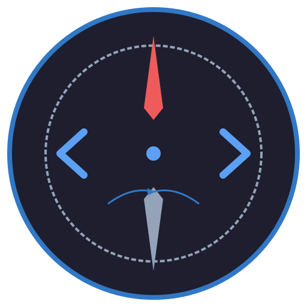

# CodeCompass

<p align="center">
  
</p>

**A local-first desktop application for understanding unfamiliar code repositories.**

[](https://github.com/Jelly-RayTian/CodeCompass/actions/workflows/ci.yml)
[](https://github.com/Jelly-RayTian/CodeCompass/releases)
[](LICENSE)
[](#installation)

**Status: v0.1.0 Alpha** — core feature set implemented, undergoing stability and usability testing.

CodeCompass analyzes TypeScript and JavaScript projects to help you navigate, understand, and assess codebases — entirely offline. No cloud uploads, no AI training on your source code, no network requests after installation.

> Screenshots are pending — see [docs/screenshots/README.md](docs/screenshots/README.md) for the capture checklist. The screenshot paths below will be populated as they are taken.

## Why I Built CodeCompass

When I join a new codebase, I ask the same questions every time: _Where is the entry point? What order should I read the files? Which modules are tightly coupled? What would break if I change this function?_

Existing tools either upload your code to the cloud or require setting up complex language servers. I wanted a **single binary** that I could point at any folder and get instant structural understanding — no configuration, no network, no risk.

## Hero Screenshot


> _Screenshot to be captured. See the screenshot checklist._

## Features

| Category                | Highlights                                                      |
| ----------------------- | --------------------------------------------------------------- |
| **Repository Scanning** | Recursive traversal, ignore rules, incremental change detection |
| **AST Analysis**        | Static/dynamic imports, re-exports, CommonJS `require`          |
| **Symbol Indexing**     | Functions, classes, interfaces, types, enums, React components  |
| **Dependency Graph**    | Interactive React Flow, cycle detection, node details, large-graph safety |
| **Symbol Search**       | Name/kind filtering, pagination, click-to-view                  |
| **Code Viewer**         | Monaco Editor, syntax highlighting, search, 1 MB safety cap     |
| **Insights**            | Entry-point detection, reading paths, structural findings       |
| **Impact Analysis**     | Call graph, transitive dependents, change risk scoring          |
| **Git Integration**     | Branch/status/commits, co-change hotspots (optional, local only)|
| **i18n**                | Chinese / English                                               |

## Demo Workflow

1. **Add Folder** — select your project directory
2. **Scan** — indexes `.ts/.tsx/.js/.jsx` files (metadata only, no content stored)
3. **Analyze** — extracts imports, symbols, and call references via OXC AST parsing
4. **Explore** — dependency graph, symbol search, source viewer
5. **Understand** — Insights for entry points, reading paths, and change-impact risks

## Architecture

```
┌─ React Frontend ──────────────────────────────┐
│  Workspaces · Graph · Insights · Viewer        │
│  Monaco Editor (bundled, offline) · React Flow │
│  i18n · useAsyncData · typed tauriClient        │
├────────────────────────────────────────────────┤
│         Tauri IPC (typed invoke)               │
├─ Rust Backend ────────────────────────────────┤
│  Scanner (walkdir) · Parser (OXC 0.45)         │
│  Symbol/Reference extraction · Graph builder   │
│  Import resolver · Git subprocess (safe args)  │
│  ScanManager / AnalysisManager (cancellation)  │
├────────────────────────────────────────────────┤
│  SQLite (WAL, rusqlite bundled, V1→V8)         │
│  refinery migrations (embedded at compile time)│
└────────────────────────────────────────────────┘
```

See [docs/architecture.md](docs/architecture.md) for the full data-flow
and layer responsibilities, and [docs/technical-decisions.md](docs/technical-decisions.md)
for the rationale behind each technology choice.

## Installation

Download from [Releases](https://github.com/Jelly-RayTian/CodeCompass/releases):

- **NSIS**: `CodeCompass_0.1.0_x64-setup.exe` (required)
- **MSI**: `CodeCompass_0.1.0_x64_en-US.msi` (optional)

> Installers are **unsigned** — Windows SmartScreen may warn. Click "More info" → "Run anyway".

**Uninstall**: Settings → Apps → CodeCompass → Uninstall. Your source files are never modified.

## Development

```bash
git clone https://github.com/Jelly-RayTian/CodeCompass.git
cd CodeCompass
npm install
npm run tauri:dev
```

## Testing

```bash
npm test                       # frontend tests (Vitest)
npm run lint                   # ESLint
npm run typecheck              # TypeScript strict check
cd src-tauri && cargo test     # 96 Rust tests
cd src-tauri && cargo clippy --all-targets -- -D warnings
```

See [docs/test-matrix.md](docs/test-matrix.md) for the full test
breakdown and [docs/benchmarks.md](docs/benchmarks.md) for performance
measurements.

## Benchmarks

Reproducible benchmarks measure scan, analysis, and graph construction
on generated fixtures of 100 / 1,000 / 5,000 source files.

```bash
npm run bench:summary          # single-shot markdown table
cd src-tauri && cargo bench    # Criterion statistical reports
```

See [docs/benchmarks.md](docs/benchmarks.md) for methodology and latest
results.

## Privacy Guarantees

- **100% local** — your source code never leaves your machine
- **No telemetry** — zero analytics, zero usage tracking
- **No network requests at runtime** — verified by static audit
- **No secrets logging** — source contents, API keys, and tokens are never logged
- **Read-only analysis** — CodeCompass never executes, modifies, or deletes your code

See [docs/privacy-audit.md](docs/privacy-audit.md) for the evidence-based
audit and [docs/privacy.md](docs/privacy.md) for the user-facing
statement.

## Screenshot Gallery

| Home | Workspaces |
| ---- | ---------- |
|  |  |

| Dependency Graph | Code Viewer |
| ---------------- | ----------- |
|  |  |

| Insights |
| -------- |
|  |

> Screenshots are captured manually before each release. If an image
> above is broken, the corresponding screenshot has not yet been taken —
> see [docs/screenshots/README.md](docs/screenshots/README.md).

## Technical Challenges & Solutions

- **Safe deletion reconciliation on cancelled scans** — a monotonic
  `scan_generation` counter (migration V8) replaces second-resolution
  timestamp comparison, so files are only marked removed after a
  *complete* traversal. Cancelled or error-degraded scans preserve the
  previous snapshot.
- **AST parsing of untrusted source** — OXC parses in-memory; malformed
  files produce diagnostics but never block analysis of the rest of the
  workspace.
- **Large-repo graph safety** — the dependency graph truncates at 500
  nodes with a `truncated` flag rather than refusing to render, so
  thousand-file repos show a clear warning instead of a silent freeze.
- **Offline Monaco** — the Monaco Editor runtime is bundled via Vite
  workers instead of loaded from a CDN, preserving the no-network
  guarantee.
- **Cross-thread SQLite access** — `Database` wraps
  `Mutex<Connection>` (Connection is `Send` not `Sync`), managed as
  Tauri state so all command handlers share one connection safely.

## Known Limitations

- **Windows only** — macOS and Linux not tested
- **Unsigned installers** — SmartScreen may warn during installation
- **TypeScript/JavaScript only** — no Python, Rust, or other language support yet
- **No auto-update** — users must manually download new versions
- **Large repos (>10k files)** — analysis is batch-only; graph view truncates to 500 nodes with a warning
- **Git optional** — the Git panel requires `git` on `PATH`; without it the panel simply shows "not a repo"

## Roadmap

| Milestone                           | Status         |
| ----------------------------------- | -------------- |
| Foundation (Tauri + React + SQLite) | ✅ Complete    |
| Repository Scanning                 | ✅ Complete    |
| AST Import Analysis                 | ✅ Complete    |
| File Dependency Graph               | ✅ Complete    |
| Symbol Indexing & Search            | ✅ Complete    |
| Code Viewer & Navigation            | ✅ Complete    |
| Entry Points & Insights             | ✅ Complete    |
| Call Graph & Impact Analysis        | ✅ Complete    |
| Git Integration                     | ✅ Complete    |
| Release Engineering & Distribution  | ✅ Complete    |
| Polish & Stable Release             | 🚧 In Progress |

See [docs/roadmap.md](docs/roadmap.md) for the detailed plan.

## Contributing

See [CONTRIBUTING.md](CONTRIBUTING.md) and [AGENTS.md](AGENTS.md) for development guidelines.

## License

MIT
